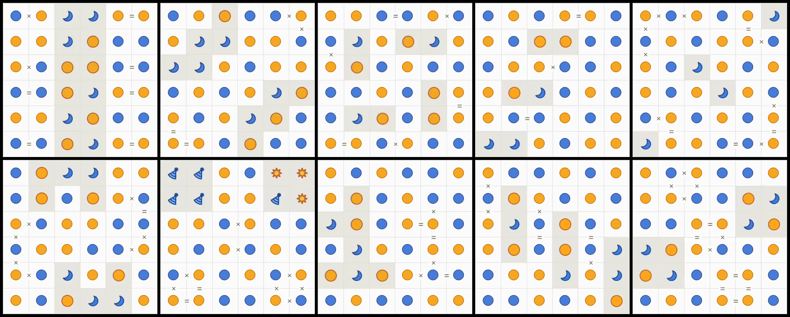

  

 

# LinkedIn's Tango puzzle solver

## About the puzzle 
This project provides an algorithm for solving LinkedIn's Tango puzzle game automatically. The puzzle is a visual logic game, 
where you need to fill a grid so that each row and column contains the same number of suns and moons. No more than 2 suns or moons
may be next to each other, either vertically or horizontally.
A tutorial on how to play can be found [here](https://www.linkedin.com/games/tango/). 

## Computer vision and backtracking
The script consists of two stages. First, an image of the grid to solve has to be parsed, and converted into a 2-dimensional $N\times N$ array 
that encodes the position of the existing suns and moons, as well the '=' and 'x' markings in the board. 
This step is done using the popular computer vision library OpenCV, as seen in [tango_parser.py](src/tango_parser.py). 
Second, a solution has to be found given this grid representation. Here, a simple backtracking strategy is used. More details can be found in [tango_solver.py](src/tango_solver.py).

## Results
The solver was tested on 20 puzzles, ranging from puzzle No. 68 to 88 (except No.79, because it is Christmas themed). With backtracking at depth 2, every puzzle was solved in under a third of a second, with an average solve time of 0.04s. Full results, with images, are available at [examples](examples). 
